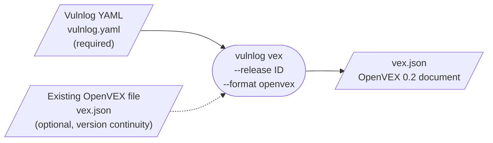
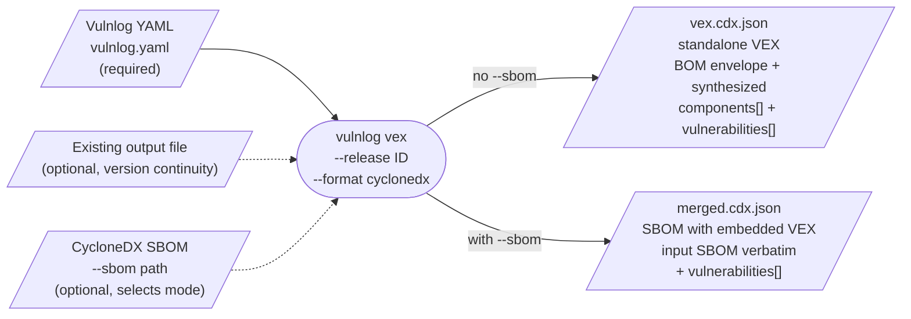

# VEX Generation

Plan and reference for generating Vulnerability Exploitability eXchange (VEX) documents from Vulnlog YAML.

Status: reviewed 2026-07-04 against OpenVEX v0.2.0, the official CycloneDX 1.6/1.7 JSON schemas, and CSAF 2.1.
Substantive changes from that review are listed in the Review log at the end of this document.

## Format landscape

Three VEX formats are in active use. Vulnlog will target them in priority order.

| Format             | Spec owner        | Primary audience                                                   |
|--------------------|-------------------|--------------------------------------------------------------------|
| OpenVEX            | CNCF / Chainguard | Cloud-native, containers, OSS maintainers                          |
| CycloneDX VEX      | OWASP             | Enterprise supply chain, SBOM-driven compliance                    |
| CSAF (VEX profile) | OASIS             | Regulated sectors, government, large vendors publishing advisories |

Cross-format conversion is lossy (justification and state vocabularies do not align) and external tooling is immature.
Each format is emitted natively from the Vulnlog source of truth.

## Priority

1. **OpenVEX** (v0.2.0, latest tagged revision as of 2026-07) as the model already aligns with the Vulnlog YAML,
   zero enum translation.
2. **CycloneDX VEX 1.7** as second writer; reuses the internal IR, adds enum mapping and BOM framing. Shipped in two
   cuts: a minimal V1 (see Phase 4) and an enrichment pass (see Phase 5).
3. **CSAF 2.1** deferred until a concrete regulated use case appears.

A fourth work item sits before all writers: issue #161 replaces the `risk acceptable` verdict with
`affected` plus an optional `disposition` field. It changes the verdict vocabulary the writers consume.
See "Planned model change (issue #161)" and the phase ordering rationale in the Action plan.

## Internal design

A format-neutral intermediate representation (IR) decouples Vulnlog semantics from the output format.

```
YAML  -->  parse  -->  VulnerabilityEntry  -->  VexStatement (IR)  -->  Writer (OpenVEX | CycloneDX | CSAF)
```

The `VexStatement` IR carries:

- Vulnerability: id (`VulnId` sealed type: Cve / Ghsa / RustSec / Snyk), aliases, description.
- Assessment: verdict, severity, justification, analysis text, analyzed date. After #161: disposition.
- Resolution: release, date, ref, note.
- Products: the target release purls that survived tag scoping (scoping happens in core; writers receive the
  final product list).
- Affected packages (subcomponent purls).
- Statement timestamp (derived, deterministic; see Determinism).

Document-level inputs (author, organization, contact, CLI version) ride alongside the statement list. Document
identity and version continuity come from the existing output file, not from the IR (see Versioning per format).

Writers are pure functions from IR to serialized bytes. Adding a format is adding a writer plus an enum translation
table.

The `reports[].suppress` data is **not** part of the IR. Suppression is a CI-pipeline concern (keeping scanners
quiet for findings the team has triaged) and is orthogonal to VEX, which describes the project's verdict to
external consumers. A vulnerability is included in the VEX based on its verdict alone, regardless of whether any
of its reporters are suppressed (decision D8).

## Statement inclusion and release ordering

Defines which vulnerability entries produce a statement when generating for target release R. This was previously
implicit; the rule below makes decision D6 precise.

### Release ordering contract

- The order of entries in `releases[]` is the authoritative release timeline: earlier list position means older
  release. The documentation already recommends appending successor releases; Phase 0 promotes this from
  convention to documented contract.
- `vulnlog validate` warns when `published_at` dates contradict the list order (a later position carrying an
  earlier date).
- Release ids stay opaque strings. No semver or date parsing: `0.11.0`, `2026-R2`, and `build-1234` are all valid
  ids, so only list position can order them.

### Inclusion rule

An entry V produces a statement for target release R if and only if the earliest release in `V.releases[]`
(by list position) is not newer than R.

| Situation                                          | In the document for R?                     |
|----------------------------------------------------|--------------------------------------------|
| Earliest release in `V.releases[]` is newer than R | No. The finding does not concern R yet.    |
| Otherwise (any verdict, resolved or not)           | Yes. Status derivation decides the status. |

Rationale: `fixed` and `not_affected` statements are positive assurance and remain in every later release's
document; consumers rely on them to close out scanner findings. A vulnerability first recorded against an older
release stays relevant to R until a resolution at or before R turns it into `fixed`.

Example: an entry recorded with `releases: [0.11.0]` and `resolution.in: 0.12.0`:

- Target `0.11.0`: included, status `affected` / `exploitable`.
- Target `0.13.0`: included, status `fixed` / `resolved`.
- A hypothetical target older than `0.11.0`: excluded.

Known limitation: a vulnerability that is fixed and later reintroduced (affected, fixed, affected again) cannot be
expressed by a single entry, because an entry carries at most one resolution. Rare in practice; see Open questions.

---

## Gaps in the Vulnlog YAML format

The Vulnlog YAML covers OpenVEX cleanly, including aliases (OpenVEX 0.2 carries them in `vulnerability.aliases`).
CycloneDX VEX surfaces concepts the YAML does not express directly. Three categories of gap, in increasing
severity:

- **Derivable**: the CycloneDX field is produced deterministically from existing YAML fields. No YAML change.
- **Lossy**: the mapping is valid but collapses distinctions or defaults a value the format allows to be richer.
- **Absent**: the YAML has no field for the concept; the CycloneDX writer omits the field entirely.

One Vulnlog field has no carrier in any target format: the vulnerability `name` (common name such as "Log4Shell").
Neither OpenVEX (where `vulnerability.name` is the primary identifier) nor CycloneDX has a friendly-name field.
It is not emitted (see Open questions for the prepend-to-description alternative).

### Derivable (no YAML change)

| CycloneDX field                        | Derivation                                                  |
|----------------------------------------|-------------------------------------------------------------|
| `vulnerability.source`                 | ID type -> `{name, url}` lookup table                       |
| `vulnerability.references[]`           | `aliases[]` + per-alias ID type lookup                      |
| `vulnerability.published`              | earliest `reports[].at`; omitted when no report has a date  |
| `vulnerability.updated`                | `analyzed_at`                                               |
| `analysis.firstIssued` / `lastUpdated` | `analyzed_at` (both fields receive the same widened value)  |
| `metadata.tools`                       | synthetic `{ "name": "vulnlog", "version": <cli version> }` |
| `metadata.supplier`                    | `project.organization`                                      |
| `metadata.authors[0]`                  | `{ name: project.author, email: project.contact }`          |

### Lossy

| CycloneDX field          | Vulnlog source             | Loss                                                                                              |
|--------------------------|----------------------------|---------------------------------------------------------------------------------------------------|
| `analysis.justification` | `justification` (5 values) | two Vulnlog values collapse onto `code_not_present` (decision D10)                                |
| `analysis.response[]`    | verdict + resolution       | intent is inferred from verdict shape; `workaround_available` unreachable; #161 removes this loss |
| `ratings[].severity`     | `severity` (4-level enum)  | no score, no vector; emitted with `method: "other"` and source "Vulnlog"                          |

### Absent

| CycloneDX field                         | Concept                                                                                        |
|-----------------------------------------|------------------------------------------------------------------------------------------------|
| `vulnerability.cwes[]`                  | CWE classification of the weakness                                                             |
| `vulnerability.workaround`              | Mitigation usable without a dependency update                                                  |
| `vulnerability.advisories[]`            | Vendor advisory URLs beyond the ID-type URL                                                    |
| `vulnerability.recommendation`          | Explicit project recommendation text                                                           |
| `vulnerability.rejected`                | Flag indicating a rejected/withdrawn CVE                                                       |
| `analysis.response[]` (direct)          | Stated intent: `update` / `will_not_fix` / `workaround_available` / `can_not_fix` / `rollback` |
| `ratings[]` (CVSS data)                 | Score + vector + method + source                                                               |
| `metadata.component.externalReferences` | Project website, source repository, issue tracker URLs                                         |

### Prioritization of YAML additions

None of the absent fields block a first CycloneDX writer (they are all optional in the spec). Priority order if
CycloneDX adoption drives YAML evolution:

1. **`disposition`** (`disposition: wont-fix`) on the vulnerability entry. Decided in issue #161 and
   `devdoc/Triage-Model.md`; the name `disposition` supersedes the earlier tentative `response` naming. Removes
   the derived-intent ambiguity in `analysis.response[]` and sharpens the OpenVEX `action_statement`.
2. **`cwes`** (`cwes: [79, 287]`) on the vulnerability entry. Standard weakness metadata. Commonly expected by
   CycloneDX consumers. No mapping ambiguity.
3. **`cvss`** object (`cvss: { score, vector, method, source }`) on the vulnerability entry. Allows emitting
   `ratings[]` with structured data. The `severity` enum stays as the human-facing summary.
4. **`workaround`** on the vulnerability entry. Distinct from free-text `analysis`. Emits directly as
   `vulnerability.workaround` and may trigger `response: [workaround_available]` in CycloneDX.
5. **`advisories`** (`advisories: [url, ...]`) on the vulnerability entry. Captures vendor advisories not
   reachable via the ID-type URL table.
6. **`project.url`**, **`project.source`**, **`project.issueTracker`**. Populate CycloneDX
   `metadata.component.externalReferences`.

These additions are incremental. Except for `disposition` (which sharpens `action_statement` text), OpenVEX 0.2
has no field for any of them; the OpenVEX writer ignores them.

---

## OpenVEX (detailed)

Spec: `https://openvex.dev/ns/v0.2.0`

### Command surface

```
vulnlog vex --release <release-id> [--output vex.json] [--format openvex]
```

Default output path: `vex.json`. Default format: `openvex`.

### Data flow



The Vulnlog YAML is the only required input. When a prior OpenVEX file exists at `--output`, its `@id`,
`version`, and `timestamp` are read for continuity (see Versioning, Document identity).

### Per-status requirements

OpenVEX makes fields mandatory per status. The writer must satisfy all three rows or the document does not
conform:

| Status                         | Spec requirement                                   | Vulnlog source                                                                                          |
|--------------------------------|----------------------------------------------------|---------------------------------------------------------------------------------------------------------|
| `not_affected`                 | MUST include `justification` or `impact_statement` | `justification` always present (required by the model); `impact_statement` added when `analysis` exists |
| `affected`                     | MUST include `action_statement`                    | derived; see Action statement derivation                                                                |
| `fixed`, `under_investigation` | no extra required fields                           | -                                                                                                       |

The `action_statement` requirement was missed in the first draft of this document, which emitted it only for
`risk acceptable` verdicts. A plain `affected` statement without `action_statement` is non-conforming.

### Minimum viable document

The smallest OpenVEX document a writer produces for a `not affected` statement:

```json
{
  "@context": "https://openvex.dev/ns/v0.2.0",
  "@id": "https://vulnlog.dev/vex/3e671687-395b-41f5-a30f-a58921a69b79",
  "author": "Vulnlog Dev Team",
  "role": "Document Creator",
  "timestamp": "2026-04-25T00:00:00Z",
  "version": 1,
  "statements": [
    {
      "vulnerability": { "name": "SNYK-JAVA-TOOLSJACKSONCORE-15907550" },
      "products": [ { "@id": "pkg:generic/vulnlog@0.11.0" } ],
      "status": "not_affected",
      "justification": "vulnerable_code_not_in_execute_path",
      "impact_statement": "The affected StreamReadConstraints is not used in the application."
    }
  ]
}
```

### Enriched multi-status example

The same release with all enrichment fields populated and one statement per status class. Entries taken from the
repository's own `vulnlog.yaml` (the third statement is hypothetical):

```json
{
  "@context": "https://openvex.dev/ns/v0.2.0",
  "@id": "https://vulnlog.dev/vex/3e671687-395b-41f5-a30f-a58921a69b79",
  "author": "Vulnlog Dev Team",
  "role": "Document Creator",
  "timestamp": "2026-04-25T00:00:00Z",
  "last_updated": "2026-05-02T00:00:00Z",
  "version": 2,
  "tooling": "vulnlog/0.15.0",
  "statements": [
    {
      "vulnerability": {
        "@id": "https://security.snyk.io/vuln/SNYK-JAVA-TOOLSJACKSONCORE-15907550",
        "name": "SNYK-JAVA-TOOLSJACKSONCORE-15907550",
        "description": "Allocation of resources without limits or throttling vulnerability in Jackson",
        "aliases": [ "GHSA-2m67-wjpj-xhg9" ]
      },
      "timestamp": "2026-04-06T00:00:00Z",
      "products": [
        {
          "@id": "pkg:generic/vulnlog@0.11.0",
          "identifiers": { "purl": "pkg:generic/vulnlog@0.11.0" },
          "subcomponents": [ { "@id": "pkg:maven/tools.jackson.core/jackson-core@3.1.0" } ]
        }
      ],
      "status": "not_affected",
      "justification": "vulnerable_code_not_in_execute_path",
      "impact_statement": "The affected StreamReadConstraints is not used in the application."
    },
    {
      "vulnerability": {
        "@id": "https://nvd.nist.gov/vuln/detail/CVE-2025-11226",
        "name": "CVE-2025-11226",
        "aliases": [ "SNYK-JAVA-CHQOSLOGBACK-13169722" ]
      },
      "timestamp": "2026-04-07T00:00:00Z",
      "products": [
        {
          "@id": "pkg:generic/vulnlog@0.11.0",
          "subcomponents": [ { "@id": "pkg:maven/ch.qos.logback/logback-core@1.3.14" } ]
        }
      ],
      "status": "affected",
      "action_statement": "The risk is accepted. No fix is planned.",
      "action_statement_timestamp": "2026-04-07T00:00:00Z",
      "status_notes": "Logback is a ktlint configuration dependency and not part of the application."
    },
    {
      "vulnerability": { "name": "CVE-2026-9999" },
      "products": [ { "@id": "pkg:generic/vulnlog@0.11.0" } ],
      "status": "under_investigation"
    }
  ]
}
```

### Field mapping (required)

| OpenVEX field                     | Vulnlog source                                                                    |
|-----------------------------------|-----------------------------------------------------------------------------------|
| `@context`                        | static: `https://openvex.dev/ns/v0.2.0`                                           |
| `@id`                             | `https://vulnlog.dev/vex/<UUID>` (see Document identity)                          |
| `author`                          | `project.author`; when `project.contact` present: `"<author> (<contact>)"`        |
| `timestamp`                       | first write: generation time (RFC 3339, UTC); updates: preserved (see Versioning) |
| `version`                         | see Versioning                                                                    |
| `statements[].vulnerability.name` | `vulnerabilities[].id`                                                            |
| `statements[].products[].@id`     | release purls filtered by tag match (a statement MUST identify a product)         |
| `statements[].status`             | derived (see Status derivation)                                                   |
| `statements[].justification`      | `vulnerabilities[].justification` (required for `not_affected`)                   |
| `statements[].action_statement`   | derived (required for `affected`; see Action statement derivation)                |

### Field mapping (enrichment)

| OpenVEX field                                 | Vulnlog source                                                                   |
|-----------------------------------------------|----------------------------------------------------------------------------------|
| `role`                                        | static: `Document Creator`                                                       |
| `tooling`                                     | `vulnlog/<cli version>`                                                          |
| `last_updated`                                | update time; emitted from version 2 onward (see Versioning)                      |
| `statements[].vulnerability.@id`              | URL by ID type (see ID URL mapping)                                              |
| `statements[].vulnerability.description`      | `vulnerabilities[].description`                                                  |
| `statements[].vulnerability.aliases[]`        | `vulnerabilities[].aliases` (plain ID strings)                                   |
| `statements[].timestamp`                      | `vulnerabilities[].analyzed_at` -> earliest `reports[].at` -> document timestamp |
| `statements[].products[].identifiers.purl`    | same purl as the product `@id`                                                   |
| `statements[].products[].subcomponents[].@id` | `vulnerabilities[].packages[]`                                                   |
| `statements[].impact_statement`               | `vulnerabilities[].analysis` (only for `not_affected`)                           |
| `statements[].status_notes`                   | `vulnerabilities[].analysis` (for all statuses except `not_affected`)            |
| `statements[].action_statement_timestamp`     | statement timestamp, when an `action_statement` is emitted                       |
| `statements[].supplier`                       | `project.organization`                                                           |

The analysis text is routed to exactly one field per statement: `impact_statement` for `not_affected` (the more
specific spec field), `status_notes` otherwise. The rationale text ("how the status was determined") is what the
Vulnlog `analysis` field holds; the `action_statement` ("what the consumer should do") is derived, not copied.

### Status derivation

| Verdict           | Resolution                                     | OpenVEX status        |
|-------------------|------------------------------------------------|-----------------------|
| `not affected`    | any                                            | `not_affected`        |
| `affected`        | present, target release >= resolution release  | `fixed`               |
| `affected`        | absent, or target release < resolution release | `affected`            |
| `risk acceptable` | any                                            | `affected`            |
| _(absent)_        | any                                            | `under_investigation` |

Changes with #161: the `risk acceptable` row disappears; former risk-accepted entries follow the `affected` rows,
so a passively fixed accepted vulnerability becomes `fixed` once the target contains the fix. See "Planned model
change (issue #161)".

### Action statement derivation

Emitted only for status `affected`, where the spec requires it. The Vulnlog `analysis` text is a rationale, not an
action, so the action text is derived:

| Case (status = `affected`)                               | `action_statement`                                                        |
|----------------------------------------------------------|---------------------------------------------------------------------------|
| verdict `affected`, resolution in a later release        | `"Update to release <id>."` (+ `resolution.note` appended when present)   |
| verdict `affected`, no resolution                        | `"No remediation is available yet."`                                      |
| verdict `risk acceptable`, resolution in a later release | `"The risk is accepted for this release. A fix ships with release <id>."` |
| verdict `risk acceptable`, no resolution                 | `"The risk is accepted. No fix is planned."`                              |

Changes with #161: the last two rows key on `disposition: wont-fix`, and `disposition: will-fix` without a
resolution yields `"A fix is planned but not yet available."`

### Justification mapping

`VexJustification` enum values already align 1:1 with OpenVEX justifications (snake_case form).

| Vulnlog                                           | OpenVEX                                             |
|---------------------------------------------------|-----------------------------------------------------|
| Component not present                             | `component_not_present`                             |
| Vulnerable code not present                       | `vulnerable_code_not_present`                       |
| Vulnerable code not in execute path               | `vulnerable_code_not_in_execute_path`               |
| Vulnerable code cannot be controlled by adversary | `vulnerable_code_cannot_be_controlled_by_adversary` |
| Inline mitigations already exist                  | `inline_mitigations_already_exist`                  |

### ID URL mapping

| Vulnerability ID type | URL prefix                              |
|-----------------------|-----------------------------------------|
| CVE                   | `https://nvd.nist.gov/vuln/detail/<ID>` |
| SNYK                  | `https://security.snyk.io/vuln/<ID>`    |
| RUSTSEC               | `https://rustsec.org/advisories/<ID>`   |
| GHSA                  | `https://github.com/advisories/<ID>`    |

### Product scoping via tags

Given a target release and a set of vulnerabilities included per the inclusion rule:

- If a vulnerability has tags, include only those release purls whose `tags` intersect the vulnerability tags
  (a single shared tag is enough, decision D3).
- Release purls without tags are always included.
- Vulnerabilities without tags are associated with all release purls of the target release.

### Versioning

The CLI is stateless. Version is derived from the existing output file.

1. Read the file at the output path.
2. If present and a valid OpenVEX document: preserve `@id`, preserve `timestamp` (the original issuance time),
   set `version` to the previous value + 1, set `last_updated` to now.
3. If absent or invalid: new `@id`, `version: 1`, `timestamp` = now, no `last_updated`.
4. Write only if statements differ from the previous document. Otherwise leave the file untouched and report
   `No changes detected.`

Statement equality: compare all statement fields; the document-level `timestamp` and `last_updated` are excluded.
Per-statement `timestamp` is part of the equality check. It is derived from YAML dates (never from the clock), so
a changed statement timestamp always indicates a changed analysis.

### Document identity

`@id` is stable across version bumps. It is read from the existing file when present and preserved. A new UUID is
generated only when no prior file exists. Whatever lives at `--output` is treated as authoritative continuity;
there is no foreign-identity heuristic (decision D9, garbage in, garbage out).

### Determinism

- Vulnlog stores dates as `LocalDate`. OpenVEX requires RFC 3339. Dates are widened to `T00:00:00Z`.
- Statement timestamps derive only from YAML dates, so the same YAML produces identical statements regardless of
  the day the CLI runs. Combined with the no-op write rule, re-running `vulnlog vex` in CI without YAML changes
  never touches the file.
- Statements are sorted by `vulnerability.name` (byte order); products, subcomponents, and aliases are sorted by
  their identifier. Serialization uses a fixed key order and 2-space indentation.
- Result: stable diffs, trivial equality checks, reproducible builds.

---

## CycloneDX VEX (detailed)

Spec: CycloneDX 1.7 (released 2025-10-21). Document envelope: `bomFormat: "CycloneDX"`, `specVersion: "1.7"`.

1.7 is a compatible successor to 1.6 for VEX. Verified against the official JSON schemas on 2026-07-04: the
`impactAnalysisState`, `impactAnalysisJustification`, and `response` enums and the full `vulnerability` field set
are byte-identical between 1.6 and 1.7. The only VEX-adjacent change is that `metadata.tools` as a flat array is
deprecated in favor of the `{components, services}` object form (see Field mapping). Third-party "what's new"
articles claiming VEX vocabulary changes in 1.7 do not match the published schemas.

CycloneDX is a BOM format that carries VEX data in a `vulnerabilities[]` array. Two shapes are in common use:

- **Standalone VEX**: a BOM whose purpose is only to carry VEX statements. `components[]` contains the minimum
  needed to anchor `affects[].ref`.
- **SBOM with embedded VEX**: an existing CycloneDX SBOM enriched with `vulnerabilities[]`. `affects[].ref`
  resolves to component `bom-ref` values already present in the SBOM.

Vulnlog supports both shapes (see Input modes).

### Command surface

```
vulnlog vex --release <release-id> --format cyclonedx [--output vex.cdx.json] [--sbom <path>]
```

Default output path with `--format cyclonedx`: `vex.cdx.json`.

`--sbom <path>` is optional. Presence selects SBOM-informed mode; absence selects standalone mode.

### Input modes

**Standalone mode** (no `--sbom`):

- `metadata.component` = synthetic product component derived from the target release
  (`bom-ref` = `<project name>@<release id>`, `name` = project name, `version` = release id; the `purl` field
  stays unset because a release can have multiple purls).
- `components[]` = one entry per release purl (bom-ref = purl string, type = `library` or `application`).
- When a vulnerability references packages, those package purls are added as components with bom-ref = purl.
  Subcomponent nesting via `components[].components[]` is not used; the flat list keeps the writer simple.
- `bom-ref` values must be unique within the BOM; using purl strings and the synthetic product ref satisfies
  this by construction.

**SBOM-informed mode** (`--sbom <path>`):

- Input SBOM is parsed; its `metadata.component`, `serialNumber`, and `components[]` define the scope of the
  emitted VEX. The SBOM identifies one specific built artifact (one Linux binary, one container image, one wheel),
  while the YAML may describe a release that bundles several such artifacts.
- For each YAML vulnerability, `packages[]` is matched against the SBOM components by canonical purl comparison
  (see Purl matching).
    - Empty intersection: the vulnerability is omitted from the output entirely. The dependency is not present in
      this artifact, so a VEX statement would be irrelevant (decision D13).
    - Partial or full intersection: a VEX statement is emitted with `affects[].ref` populated from the matched SBOM
      `bom-ref`s only.
- Release purls in the YAML are not used to anchor `affects[].ref` in this mode; the SBOM's `metadata.component`
  is the product anchor.
- Output is a single document that is the input SBOM augmented with `vulnerabilities[]`. The input
  `serialNumber`, `components[]`, `dependencies[]`, and `metadata` are preserved; only `metadata.timestamp`,
  `version`, and `vulnerabilities[]` are written by Vulnlog.
- If the input SBOM already contains a `vulnerabilities[]` array (some scanners emit SBOM and findings in one
  document), Vulnlog replaces it entirely and warns, listing the dropped vulnerability ids. Vulnlog owns the VEX
  layer of its output; merging foreign entries is a possible later refinement (see Open questions).
- Filtering by intersection (rather than hard-failing on unmatched purls) reflects the real workflow: a Vulnlog
  YAML covers all release artifacts for a project, but each SBOM covers exactly one of them. Vulnerabilities
  attached to packages that are not in this artifact are correctly absent from this artifact's VEX.

### Purl matching

SBOM generators routinely attach purl qualifiers (`?type=jar`, `?distro=debian-12`) that the hand-written Vulnlog
YAML does not carry. Exact string equality would silently produce empty intersections and empty VEX documents.

Rule: purls are parsed and compared on the canonical `type`, `namespace`, `name`, and `version` components
(case normalization per the purl spec). Qualifiers and subpath are ignored on both sides.

The trade-off is over-matching across qualifier variants (for example two classifiers of the same Maven GAV).
Accepted for V1; a `--strict-purl` flag can restore full-string comparison later if a real case demands it.

### Data flow



The `--sbom` flag is the mode selector. Without it, the CLI produces a small standalone VEX. With it, the CLI
produces a single document that is the input SBOM plus a `vulnerabilities[]` array; the same file is both an
SBOM and a VEX.

### Design note: what `affects[].ref` anchors on

CycloneDX practice is split. The spec's own VEX examples anchor `affects[].ref` at the vulnerable component
(the library), while Dependency-Track also accepts refs pointing at `metadata.component` and then applies the
analysis project-wide. Vulnlog resolves this per mode:

- **Standalone mode anchors on the product**: `affects[].ref` lists the tag-scoped release purls. This mirrors
  OpenVEX `products[]`, keeps the IR mapping uniform, and preserves tag scoping (which artifact of the release is
  affected). Package purls appear in `components[]` for context but are not referenced from `affects[]`.
- **SBOM-informed mode anchors on the vulnerable component**: `affects[].ref` lists the matched package
  `bom-ref`s, which is the shape component-matching consumers such as Dependency-Track resolve best.

Consumers that need component-precise refs resolvable against their own SBOM should use `--sbom` mode; that is
its purpose.

### Field scope

Each mapping row is tagged:

- **R**: required by the CycloneDX 1.7 JSON schema. Always emitted.
- **V1**: not required by the schema but included in the minimal first implementation. Without these the document
  would be technically valid but operationally useless.
- **V2**: deferred to a later iteration. Emitted only once the corresponding Vulnlog data or writer logic exists.

The schema's strict required set is extremely narrow: only `bomFormat` and `specVersion` at the document level,
`affects[].ref` inside an affects entry, and `references[].{id,source}` inside a reference. Everything else is
optional by the schema. The **V1** tag captures what a useful VEX document must carry beyond that bare minimum.

### Field mapping (document)

| CycloneDX field      | Scope | Source                                                                                  |
|----------------------|-------|-----------------------------------------------------------------------------------------|
| `bomFormat`          | R     | static: `"CycloneDX"`                                                                   |
| `specVersion`        | R     | static: `"1.7"`                                                                         |
| `serialNumber`       | V1    | see Versioning (existing output, input SBOM, or new `urn:uuid:<UUID>`)                  |
| `version`            | V1    | see Versioning                                                                          |
| `metadata.timestamp` | V1    | document generation time (RFC 3339, UTC)                                                |
| `metadata.component` | V1    | standalone: synthetic product; SBOM-informed: preserved from input                      |
| `components[]`       | V1    | standalone: one entry per release purl and per package purl (bom-ref = purl)            |
| `metadata.tools`     | V2    | object form with `components: [{ name: "vulnlog", version: <cli version> }]` (see note) |
| `metadata.authors[]` | V2    | `[{ name: project.author, email: project.contact }]` (email when present)               |
| `metadata.supplier`  | V2    | `{ name: project.organization }`                                                        |

The flat-array form of `metadata.tools` is deprecated in 1.7; the object form is used once tools are emitted.

### Field mapping (vulnerability)

| CycloneDX field                            | Scope | Source                                                                                              |
|--------------------------------------------|-------|-----------------------------------------------------------------------------------------------------|
| `vulnerabilities[].id`                     | V1    | `vulnerabilities[].id`                                                                              |
| `vulnerabilities[].analysis.state`         | V1    | derived (see State derivation)                                                                      |
| `vulnerabilities[].analysis.justification` | V1    | translated from `vulnerabilities[].justification` (see Justification)                               |
| `vulnerabilities[].analysis.detail`        | V1    | `vulnerabilities[].analysis`                                                                        |
| `vulnerabilities[].affects[].ref`          | R\*   | standalone: tag-scoped release purl bom-refs; SBOM mode: matched package bom-refs (see Design note) |
| `vulnerabilities[].bom-ref`                | V2    | stable: `vuln:<vulnerabilities[].id>`                                                               |
| `vulnerabilities[].source.{name,url}`      | V2    | derived from ID type (see Source mapping)                                                           |
| `vulnerabilities[].references[]`           | V2    | `vulnerabilities[].aliases` (one entry per alias, see Aliases)                                      |
| `vulnerabilities[].description`            | V2    | `vulnerabilities[].description`                                                                     |
| `vulnerabilities[].published`              | V2    | earliest `reports[].at` widened to UTC; omitted when no report has a date                           |
| `vulnerabilities[].updated`                | V2    | `vulnerabilities[].analyzed_at` widened to UTC                                                      |
| `vulnerabilities[].analysis.response[]`    | V2    | derived (see Response derivation)                                                                   |
| `vulnerabilities[].analysis.firstIssued`   | V2    | `vulnerabilities[].analyzed_at` widened to UTC                                                      |
| `vulnerabilities[].analysis.lastUpdated`   | V2    | `vulnerabilities[].analyzed_at` widened to UTC                                                      |
| `vulnerabilities[].ratings[]`              | V2    | `severity` + `method: "other"` + `source.name: "Vulnlog"` (see note)                                |

\* `affects[].ref` is required only inside an `affects[]` entry. The `affects[]` array itself is optional per
schema, but emitting it is V1 because without it the VEX statement has no product anchor.

The Vulnlog severity is the project's own assessment of impact, not an upstream CVSS rating (decision D12). It is
emitted as `ratings: [{ severity, method: "other", source: { name: "Vulnlog" } }]` so consumers can distinguish
it from NVD-derived ratings. A future iteration may add a second `ratings[]` entry from a CVSS internet lookup.

### Minimum viable V1 documents

Both output shapes carry the same VEX information; the difference is in the surrounding `components[]` and how
`affects[].ref` resolves.

#### Standalone (no `--sbom`)

The CLI synthesizes the BOM envelope. `affects[].ref` references a `bom-ref` set to the release purl.

```json
{
  "bomFormat": "CycloneDX",
  "specVersion": "1.7",
  "serialNumber": "urn:uuid:3e671687-395b-41f5-a30f-a58921a69b79",
  "version": 1,
  "metadata": {
    "timestamp": "2026-04-25T00:00:00Z",
    "component": { "bom-ref": "vulnlog@0.11.0", "type": "application", "name": "vulnlog", "version": "0.11.0" }
  },
  "components": [
    { "bom-ref": "pkg:generic/vulnlog@0.11.0", "type": "application", "name": "vulnlog", "version": "0.11.0" }
  ],
  "vulnerabilities": [
    {
      "id": "SNYK-JAVA-TOOLSJACKSONCORE-15907550",
      "analysis": {
        "state": "not_affected",
        "justification": "code_not_reachable",
        "detail": "The affected StreamReadConstraints is not used in the application."
      },
      "affects": [ { "ref": "pkg:generic/vulnlog@0.11.0" } ]
    }
  ]
}
```

#### SBOM-embedded (with `--sbom myapp.cdx.json`)

The input SBOM defines `serialNumber`, `metadata.component`, `components[]`, and `dependencies[]`. The CLI adds
`vulnerabilities[]` and rewrites `metadata.timestamp` and `version`. `affects[].ref` references existing SBOM
`bom-ref`s.

```json
{
  "bomFormat": "CycloneDX",
  "specVersion": "1.7",
  "serialNumber": "urn:uuid:abcdef01-2345-6789-abcd-ef0123456789",
  "version": 2,
  "metadata": {
    "timestamp": "2026-04-25T00:00:00Z",
    "component": {
      "bom-ref": "app-vulnlog-0.11.0",
      "type": "application",
      "name": "vulnlog",
      "version": "0.11.0",
      "purl": "pkg:maven/dev.vulnlog/vulnlog@0.11.0"
    }
  },
  "components": [
    {
      "bom-ref": "lib-jackson-core-3.1.0",
      "type": "library",
      "name": "jackson-core",
      "version": "3.1.0",
      "purl": "pkg:maven/tools.jackson.core/jackson-core@3.1.0"
    }
  ],
  "dependencies": [
    { "ref": "app-vulnlog-0.11.0", "dependsOn": [ "lib-jackson-core-3.1.0" ] }
  ],
  "vulnerabilities": [
    {
      "id": "SNYK-JAVA-TOOLSJACKSONCORE-15907550",
      "analysis": {
        "state": "not_affected",
        "justification": "code_not_reachable",
        "detail": "The affected StreamReadConstraints is not used in the application."
      },
      "affects": [ { "ref": "lib-jackson-core-3.1.0" } ]
    }
  ]
}
```

Both documents validate against the CycloneDX 1.7 schema. The standalone form is self-contained but minimal; the
SBOM-embedded form is a richer document because it inherits the SBOM's component graph. The `version: 2` in the
second example shows serialNumber adoption from the input SBOM: the enriched document is a new version of that
BOM identity (see Versioning).

### State derivation

| Verdict           | Resolution                                     | CycloneDX state |
|-------------------|------------------------------------------------|-----------------|
| `not affected`    | any                                            | `not_affected`  |
| `affected`        | present, target release >= resolution release  | `resolved`      |
| `affected`        | absent, or target release < resolution release | `exploitable`   |
| `risk acceptable` | any                                            | `exploitable`   |
| _(absent)_        | any                                            | `in_triage`     |

Changes with #161: the `risk acceptable` row disappears; see "Planned model change (issue #161)".

CycloneDX distinguishes `resolved` from `exploitable`, matching Vulnlog's distinction between fixed-here and
fixed-later or not-fixed. The OpenVEX writer collapses both risk-accepted and unresolved-affected into `affected`;
the CycloneDX writer keeps the `exploitable` label consistent but differentiates intent through `response[]`.

`resolved_with_pedigree` and `false_positive` are not produced. `false_positive` implies the scanner misidentified
the code, which is expressible in Vulnlog only as a `not affected` verdict with a justification; keeping the same
`not_affected` mapping keeps the meaning explicit.

### Response derivation

`analysis.response[]` signals what the project intends to do. It is a CycloneDX-only concept without a 1:1 Vulnlog
field and is derived from verdict + resolution.

| Verdict           | Resolution                                     | `response[]`                 |
|-------------------|------------------------------------------------|------------------------------|
| `affected`        | present, target release >= resolution release  | `["update"]`                 |
| `affected`        | present, target release < resolution release   | `["update"]` (fix planned)   |
| `affected`        | absent                                         | omitted                      |
| `risk acceptable` | present, target release < resolution release   | `["will_not_fix", "update"]` |
| `risk acceptable` | absent or target release >= resolution release | `["will_not_fix"]`           |
| `not affected`    | any                                            | omitted                      |
| _(absent)_        | any                                            | omitted                      |

`risk acceptable` always carries `will_not_fix`: the verdict states the project is not remediating, even when a
later release coincidentally ships a fix (decision D11). `update` is added alongside when a future resolution
release is on file, signaling that an upgrade path exists.

Changes with #161: `response[]` derives from disposition + resolution instead; the future table is in
"Planned model change (issue #161)".

`workaround_available` is not emitted; Vulnlog does not currently model workarounds distinctly from analysis text.
`can_not_fix` and `rollback` are not emitted; they do not map cleanly from Vulnlog's verdict vocabulary.

### Justification mapping

Lossy. CycloneDX uses a technical-controls vocabulary; Vulnlog (and OpenVEX) use a code-reachability vocabulary.

| Vulnlog                                           | CycloneDX                         | Notes                               |
|---------------------------------------------------|-----------------------------------|-------------------------------------|
| Component not present                             | `code_not_present`                | CycloneDX merges component and code |
| Vulnerable code not present                       | `code_not_present`                | exact fit                           |
| Vulnerable code not in execute path               | `code_not_reachable`              | exact fit                           |
| Vulnerable code cannot be controlled by adversary | `protected_by_mitigating_control` | imperfect; no direct equivalent     |
| Inline mitigations already exist                  | `protected_by_mitigating_control` | exact fit                           |

Consequences of the `Component not present` -> `code_not_present` collapse: two distinct Vulnlog justifications
produce the same CycloneDX output (accepted, decision D10). Round-tripping from CycloneDX back to Vulnlog is not
supported.

`requires_configuration`, `requires_dependency`, `requires_environment`, `protected_by_compiler`,
`protected_at_runtime`, and `protected_at_perimeter` are not produced. Adding them requires additional Vulnlog
vocabulary.

### Source mapping

| Vulnerability ID type | `source.name`       | `source.url` prefix                     |
|-----------------------|---------------------|-----------------------------------------|
| CVE                   | `NVD`               | `https://nvd.nist.gov/vuln/detail/<ID>` |
| GHSA                  | `GitHub Advisories` | `https://github.com/advisories/<ID>`    |
| SNYK                  | `Snyk`              | `https://security.snyk.io/vuln/<ID>`    |
| RUSTSEC               | `RustSec`           | `https://rustsec.org/advisories/<ID>`   |

### Aliases

CycloneDX carries aliases as `references[]`; OpenVEX 0.2 carries them as `vulnerability.aliases`. Both writers
emit them. Each Vulnlog `aliases[]` entry becomes:

```json
{
  "id": "<alias>",
  "source": {
    "name": "<derived>",
    "url": "<derived>"
  }
}
```

Source name and URL are derived from the alias ID type using the same table as the primary id.

### Product scoping via tags

Identical to OpenVEX. Given a target release and a vulnerability:

- If the vulnerability has tags, `affects[].ref` includes only release purls whose `tags` intersect the
  vulnerability tags.
- Release purls without tags are always included.
- Vulnerabilities without tags are associated with all release purls of the target release.

In standalone mode the bom-refs are the purl strings themselves. In SBOM-informed mode the bom-refs are whatever
the input SBOM assigned, and tag scoping does not apply (the SBOM already identifies exactly one artifact).

### Versioning

The CLI is stateless. `serialNumber` and `version` are derived from the files it is given.

Standalone mode:

1. Existing output present and valid: preserve its `serialNumber`, `version` = its version + 1.
2. Otherwise: new `serialNumber` (`urn:uuid:<UUID>`), `version` = 1.

SBOM-informed mode:

1. Existing output present and valid: adopt its `serialNumber`. Version base = its version; when the input SBOM
   carries the same `serialNumber`, base = max(output version, SBOM version). `version` = base + 1.
2. No existing output, input SBOM has a `serialNumber`: adopt it; `version` = SBOM version + 1. The enriched
   document is a new version of that BOM identity, so restarting at 1 would collide with the input.
3. No existing output, SBOM has no `serialNumber`: new `serialNumber`, `version` = 1.

No-op rule: write only if the document content differs from the existing output, comparing everything except
`version` and `metadata.timestamp`. `analysis.lastUpdated` is ignored when all other analysis fields are
unchanged; a changed `analyzed_at` in the YAML is a real change and forces a version bump. In SBOM-informed mode
the comparison includes the SBOM part, so a regenerated SBOM with content changes produces a new version even
when the VEX statements are unchanged.

### Document identity

`serialNumber` is stable across version bumps. It is preserved when an existing output file is present. A new UUID
is generated only when no prior file exists and no SBOM `serialNumber` is inherited (decision D9: inputs are
trusted, no foreign-identity heuristic).

Document identity is independent per format: the OpenVEX `@id` and the CycloneDX `serialNumber` for the same
release are unrelated (decision D4).

### Determinism

Same rules as OpenVEX: `LocalDate` widened to `T00:00:00Z`; vulnerability entries sorted by id; `affects[]`,
`references[]`, and synthesized `components[]` sorted by their identifiers; fixed key order and indentation.
Two documents generated on the same inputs are byte-identical regardless of the day the CLI runs, except for
`metadata.timestamp`.

## CSAF (brief)

Spec: OASIS CSAF with the VEX profile. CSAF 2.1 is the current OASIS Standard (published 2026-02-25); CSAF 2.0
remains widely deployed and is additionally an ISO/IEC standard.

- Heaviest format. Requires `document`, `product_tree`, `vulnerabilities` sections with strict schema.
- Product status grouped by state (`known_affected`, `known_not_affected`, `fixed`, `under_investigation`) rather
  than per-statement.
- The VEX profile mirrors OpenVEX's per-status requirements: `known_affected` products need a remediation entry
  and `known_not_affected` products need a justification (flag) or impact statement. The action-statement
  derivation built for OpenVEX carries over.
- Mandatory publisher, tracking, distribution metadata.
- Relevant 2.1 changes for a future writer: remediation categories gain `fix_planned` and `optional_patch`
  (crisp targets for the #161 disposition), the product `purl` field becomes a `purls` array, and TLP v2 labels
  replace TLP v1.
- Primary relevance: CISA, BSI, Red Hat, SUSE, Oracle, Cisco advisory workflows.

Deferred until a concrete regulated use case appears. When picked up, target CSAF 2.1 directly.

---

## Planned model change (issue #161)

`devdoc/Triage-Model.md` records the agreed direction: remove the `risk acceptable` verdict; express the same
intent as `affected` + `severity` + optional `disposition: will-fix | wont-fix`. The tables in this document
describe the current model; rows that change are marked "Changes with #161". Summary of the future derivations:

Status derivation (both formats): disposition never influences status. Status = verdict + resolution vs target.
The `risk acceptable` rows disappear; former risk-accepted entries follow the plain `affected` rows.

Behavior change worth noting: an accepted vulnerability with a passive fix (`wont-fix` + resolution) is emitted
today as `affected` / `exploitable` for every target; under #161 it becomes `fixed` / `resolved` for targets that
contain the fix. Example from `vulnlog.yaml`: CVE-2023-6481 (risk acceptable, resolution in 0.12.0) flips from
`exploitable` to `resolved` for target 0.12.0. The new output is more correct: consumers get positive fixed
assurance instead of a permanently open finding.

Future CycloneDX `response[]` derivation:

| State (verdict + resolution vs target) | Disposition                         | `response[]`                 |
|----------------------------------------|-------------------------------------|------------------------------|
| `resolved` (fix contained in target)   | any or absent                       | `["update"]`                 |
| `exploitable`                          | `wont-fix`, no resolution           | `["will_not_fix"]`           |
| `exploitable`                          | `wont-fix`, resolution after target | `["will_not_fix", "update"]` |
| `exploitable`                          | `will-fix` (any resolution)         | `["update"]`                 |
| `exploitable`                          | absent, resolution after target     | `["update"]`                 |
| `exploitable`                          | absent, no resolution               | omitted                      |
| `not_affected` / `in_triage`           | any                                 | omitted                      |

Future OpenVEX `action_statement` defaults keyed on disposition are listed in the Action statement derivation
section. YAML syntax, validation rules, and migration mechanics live in `devdoc/Triage-Model.md`.

---

## Action plan

Phase ordering rationale: #161 comes before the writers because it changes the verdict vocabulary the IR carries,
the response/action derivations, and the YAML syntax. Building the IR on the old model would force a writer
refactor and a second YAML migration within a few releases. OpenVEX then ships first (zero enum translation),
CycloneDX standalone second, SBOM-informed mode third (needs the purl matching machinery), CSAF last (no demand
yet).

### Phase 0: decisions and groundwork (blocking, no writer code)

1. Promote the release ordering contract (list order is authoritative) from convention to documented contract in
   the format docs; add a `vulnlog validate` warning when `published_at` contradicts list order.
2. Confirm the zero-purl policy: `vulnlog vex` hard-fails with a clear error when the target release declares no
   purls (decision D2); `vulnlog validate` warns. Note: the repository's own `vulnlog.yaml` currently declares no
   purls on any release and needs them before `vulnlog vex` can run on it.
3. Confirm #161 sequencing (recommended: Phase 1, before the IR and writers).

### Phase 1: verdict rework (issue #161)

1. Model: remove `Verdict.RiskAcceptable`; add the disposition concept (Kotlin shape per the open question in
   `Triage-Model.md`).
2. Parser: accept the legacy `verdict: risk acceptable` token during a deprecation window, mapping it to
   `affected` + `disposition: wont-fix` with a warning; canonical writes emit the new form.
3. JSON schema: add `disposition`; keep the legacy verdict enum value during the window, marked deprecated.
4. Report mapping: `affected` + `wont-fix` reproduces the current DISMISSED/RESOLVED behavior (details in
   `Triage-Model.md`).
5. Documentation: `verdicts-and-justifications.adoc`, `migration-guide.adoc`.

### Phase 2: IR and OpenVEX writer

1. Introduce `VexStatement` IR in `modules/lib/.../model`.
2. Implement statement inclusion (earliest affected release vs target) and status derivation in `lib/core`.
3. Implement tag-based product scoping in `lib/core`.
4. Implement action-statement derivation and the analysis-text routing (`impact_statement` vs `status_notes`).
5. Implement OpenVEX writer in `lib/parse/vex/openvex/` (DTO + Jackson serialization + writer), including
   `aliases`, `tooling`, `role`, and deterministic ordering/serialization.
6. Implement version, `@id`, and `timestamp` continuity from an existing OpenVEX file; `last_updated` on updates.
7. Implement statement equality and no-op write short-circuit.
8. Add `VexCommand` in `modules/cli-app/.../cli/shell/` alongside `SuppressCommand`.
9. Tests: unit tests on inclusion, status/action derivation, tag scoping, version increment, equality, and writer
   output; golden-file tests; validate emitted documents with `vexctl` (or the go-vex validator) as a conformance
   oracle in CI where feasible.

### Phase 3: documentation

1. Add a `cli-vex.adoc` page under `docs/modules/ROOT/pages/` mirroring the `cli-suppress.adoc` shape.
2. Extend `cli-overview.adoc` with the new command.

### Phase 4: CycloneDX V1 writer (standalone mode, minimal fields)

Scope: the fields tagged **R** and **V1** in the field-mapping tables. Produces documents of the shape shown in
"Minimum viable V1 documents".

1. Add `VexJustification` -> CycloneDX justification translation in `lib/core`.
2. Add state derivation (`resolved` / `exploitable` / `not_affected` / `in_triage`) on the shared IR.
3. Implement CycloneDX DTOs and Jackson serialization in `lib/parse/vex/cyclonedx/` covering only V1 fields.
4. Implement CycloneDX writer: BOM envelope, `metadata.timestamp` and synthetic `metadata.component`,
   `components[]` from release purls and package purls, `vulnerabilities[]` with `id` +
   `analysis.{state,justification,detail}` + `affects[].ref` (product anchoring per the Design note).
5. Implement `serialNumber` and `version` continuity from an existing output.
6. Implement the no-op write short-circuit (equality minus `version` and `metadata.timestamp`).
7. Add `--format cyclonedx` flag and default output path `vex.cdx.json` in `VexCommand`.
8. Tests: translation tables, envelope, versioning, equality, tag scoping; schema-validate emitted documents
   against the CycloneDX 1.7 JSON schema in unit tests.

### Phase 5: CycloneDX V2 writer (enrichment)

Scope: the fields tagged **V2** in the field-mapping tables. Each item is independently shippable.

1. `vulnerabilities[].bom-ref` stable identifier.
2. `source.{name,url}` from ID type.
3. `references[]` from aliases.
4. `description`, `published`, `updated` fields.
5. `analysis.response[]` derivation and `analysis.firstIssued` / `lastUpdated`.
6. `ratings[]` from Vulnlog severity (`method: "other"`, source "Vulnlog").
7. `metadata.tools` (object form), `metadata.authors[]`, `metadata.supplier`.
8. Tests and schema validation per added field.

### Phase 6: CycloneDX writer (SBOM-informed mode)

1. Add `--sbom <path>` CLI flag.
2. Implement CycloneDX SBOM parser (input-only DTOs, minimum fields: `serialNumber`, `version`,
   `metadata.component`, `components[].bom-ref`, `components[].purl`).
3. Implement canonical purl matching (type/namespace/name/version; qualifiers and subpath ignored).
4. Implement intersection filtering: omit vulnerabilities with no matched package; emit matched subsets only
   (decision D13; no hard-fail).
5. Implement merged-document emission preserving input `components[]`, `dependencies[]`, and `metadata`;
   replace any pre-existing `vulnerabilities[]` with a warning listing dropped ids.
6. Implement `serialNumber` and `version` precedence rules (existing output wins; adopted SBOM identity continues
   the SBOM's version sequence).
7. Tests: SBOM parsing, purl matching incl. qualifier cases, empty/partial intersection, merged output structure,
   serialNumber/version precedence, replacement warning.

### Phase 7 (deferred): CSAF writer

Deferred until required. Target CSAF 2.1.

---

## Resolved design decisions

Condensed from the original question-and-answer log; numbering unchanged (D1 = question 1).

1. **D1, release ordering.** List order in `releases[]` is the timeline; the docs recommend appending successor
   releases. This review promotes it to a documented contract with a validate warning (see Statement inclusion).
2. **D2, missing release purls.** Every release is expected to declare at least one purl. `vulnlog vex` hard-fails
   with a clear error when the target release has none.
3. **D3, tag matching.** A single shared tag between vulnerability and purl is enough to include the purl. Tags
   typically name release artifacts, which allows a VEX document scoped to one artifact.
4. **D4, identity across formats.** Each generated VEX document has its own identity. Anything not in the Vulnlog
   YAML is derived from the previous Vulnlog-generated file (version), the provided SBOM (references), or the
   internet (future lookups such as CWE by CVE).
5. **D5, aliases.** Concepts absent from an output format are simply not emitted; concepts the format supports are
   emitted when they add consumer value. Aliases are emitted in both formats (OpenVEX `vulnerability.aliases`,
   CycloneDX `references[]`).
6. **D6, one release per invocation.** The CLI accepts exactly one release. Vulnerabilities recorded against
   earlier releases that are still relevant are included; vulnerabilities recorded only against successor releases
   are not (made precise in Statement inclusion).
7. **D7, under-investigation content.** The output specification defines what a valid statement is; Vulnlog emits
   the minimal valid statement (`vulnerability` + `products` + status) when no verdict exists.
8. **D8, suppressed reports.** VEX ignores suppression data. Suppressions exist to keep CI scanner pipelines green
   for already-triaged findings; VEX communicates the verdict.
9. **D9, foreign output files.** The CLI is stateless and trusts its inputs; whatever lives at `--output` is
   authoritative continuity. Garbage in, garbage out. No identity-hijack heuristic.
10. **D10, justification collapse.** `Component not present` and `Vulnerable code not present` both map to
    CycloneDX `code_not_present`. Accepted; can be improved later.
11. **D11, risk-acceptable response.** Risk acceptance means the project will not fix (at least not soon), so
    `will_not_fix` is always emitted, with `update` alongside when a future fix release is on file.
12. **D12, ratings source.** The Vulnlog severity is emitted as a rating with source "Vulnlog". It is more
    relevant than a generic CVSS score because it reflects the analyzed impact on this project (a CVSS 10 finding
    can be `not affected` here, or exploitable-but-tricky and rated low). A CVSS lookup may be added later.
13. **D13, unmatched purls in SBOM mode.** The VEX contains only statements for vulnerabilities whose packages
    appear in the SBOM. Example: a curl release YAML covers all artifacts; the VEX generated against the Linux
    binary's SBOM contains only that binary's vulnerabilities. Omission, not failure.
14. **D14, output shape per format.** Some VEX formats are SBOM-complementary files, others embed in the SBOM.
    Vulnlog adopts what each format requires (OpenVEX: standalone document; CycloneDX: both shapes).

## Open questions

1. **Purl qualifier policy.** Proposed: canonical comparison ignoring qualifiers/subpath (see Purl matching).
   Confirm, or require strict equality with a normalization pass in `vulnlog validate` instead.
2. **Foreign `vulnerabilities[]` in an input SBOM.** Proposed: replace wholesale with a warning. Alternative:
   merge by vulnerability id, Vulnlog entries winning on conflict.
3. **Vulnerability `name` (common name).** No carrier in either format. Proposed: not emitted. Alternative:
   prepend to `description` ("Log4Shell: ...").
4. **Reintroduced vulnerabilities.** One entry carries at most one resolution, so affected -> fixed -> affected
   again is inexpressible. Rare; revisit if it occurs in practice (would need a second entry with a distinct id,
   which the uniqueness rule currently forbids for the same CVE).
5. Triage-model questions (report buckets, Kotlin shape, migration window) are tracked in
   `devdoc/Triage-Model.md`.

---

## Glossary

Non-Vulnlog terms used in this document. Vulnlog-specific terms (verdict, justification, release, tag, purl, etc.)
are defined in `docs/modules/ROOT/pages/glossary.adoc`.

**VEX**: Vulnerability Exploitability eXchange. A class of documents in which a producer states, for each
vulnerability flagged against a product, whether the product is actually exploitable. VEX is a verdict layer over
raw scanner output, not a vulnerability database.

**OpenVEX**: a VEX format maintained by the CNCF, originated by Chainguard. Spec at `https://openvex.dev`.
Minimal vocabulary; aligns 1:1 with Vulnlog's verdict and justification model. Current release: v0.2.0.

**CycloneDX**: an SBOM format maintained by OWASP. Carries VEX data inside `vulnerabilities[]`, either standalone
or embedded in an SBOM. Spec at `https://cyclonedx.org`. Current version: 1.7.

**CSAF**: Common Security Advisory Framework. An OASIS standard with a VEX profile. Schema-heavy; primary use is
regulated-sector advisory publishing (CISA, BSI, large vendors). Current version: 2.1 (OASIS Standard,
2026-02-25); 2.0 is also published as an ISO/IEC standard.

**SBOM**: Software Bill of Materials. A document inventorying the components that make up a software artifact.

**BOM**: Bill of Materials. The CycloneDX umbrella term for any document the spec describes; an SBOM is a BOM,
and a CycloneDX VEX document is also a BOM.

**IR**: Intermediate Representation. A format-neutral in-memory model (`VexStatement` in this doc) that holds
the verdict + product + vulnerability information before a writer serializes it to a specific format.

**`@id`**: JSON-LD identifier field used by OpenVEX. Identifies a document or a referenced object with an IRI.
The OpenVEX document's `@id` is its stable identity across version bumps.

**`bom-ref`**: CycloneDX local identifier on a component, service, or vulnerability. Other parts of the same BOM
reference it via `affects[].ref`, `dependencies`, etc. Must be unique within the BOM.

**`serialNumber`**: CycloneDX BOM identity field. A URN UUID (`urn:uuid:<UUID>`) that uniquely identifies a BOM
document across versions.

**BOM-Link**: a URI scheme (`urn:cdx:<serialNumber>/<version>#<bom-ref>`) for referencing an element in another
CycloneDX document. Not used in the V1 writer.

**purl**: Package URL. Vulnlog's existing glossary covers this; mentioned here only because both OpenVEX and
CycloneDX consume purls as component identifiers. A purl consists of type, namespace, name, version, plus
optional qualifiers and subpath; Vulnlog's SBOM matching compares the first four.

**Dependency-Track**: OWASP vulnerability management platform and the most common CycloneDX VEX consumer. Applies
imported VEX analysis by matching the vulnerability id and resolving `affects[].ref` against project components
or the project's `metadata.component`.

**vexctl**: the OpenVEX reference CLI (create, merge, attest, validate OpenVEX documents). Useful as a
conformance oracle in tests.

**CVE**: Common Vulnerabilities and Exposures. The MITRE-curated identifier scheme for publicly disclosed
vulnerabilities (e.g., `CVE-2021-44228`).

**GHSA**: GitHub Security Advisory identifier (e.g., `GHSA-jfh8-c2jp-5v3q`).

**SNYK ID**: Snyk's vulnerability identifier (e.g., `SNYK-JAVA-TOOLSJACKSONCORE-15907550`).

**RUSTSEC ID**: RustSec advisory identifier for Rust crates (e.g., `RUSTSEC-2020-0001`).

**NVD**: National Vulnerability Database, maintained by NIST. The canonical source URL for CVE detail pages.

**CWE**: Common Weakness Enumeration. A MITRE catalog of software weakness types (e.g., CWE-79 for XSS). Used in
CycloneDX `vulnerabilities[].cwes[]` to classify the underlying weakness.

**CVSS**: Common Vulnerability Scoring System. A scoring method (FIRST.org) for vulnerability severity. CycloneDX
`ratings[]` can carry a CVSS score, vector, and method.

**RFC 3339**: date-time format used by both OpenVEX and CycloneDX timestamps (`YYYY-MM-DDTHH:MM:SSZ`). A subset
of ISO 8601.

**UUID**: Universally Unique Identifier (RFC 4122). CycloneDX `serialNumber` and OpenVEX `@id` both incorporate
a UUID for global uniqueness.

**URN UUID**: a UUID expressed as a URN: `urn:uuid:<UUID>`. The format CycloneDX requires for `serialNumber`.

---

## Review log (2026-07-04)

Findings from a full review against the specs (OpenVEX v0.2.0 text, official CycloneDX 1.6/1.7 JSON schemas,
CSAF 2.1) and the codebase:

1. **Spec-compliance fix.** OpenVEX requires `action_statement` for every `affected` statement; the previous
   draft emitted it only for risk-accepted entries, producing non-conforming documents for plain `affected`.
   Added the Per-status requirements section and the Action statement derivation table.
2. **Corrected aliases claim.** OpenVEX 0.2 does carry aliases (`vulnerability.aliases`); the previous draft
   claimed otherwise. Aliases are now mapped in both formats; open question D5 resolved accordingly.
3. **New OpenVEX enrichment fields.** `tooling`, `last_updated`, `status_notes`, `supplier`, and product
   `identifiers` were missing from the mapping. Analysis text is now routed explicitly (`impact_statement` for
   `not_affected`, `status_notes` otherwise) instead of being dropped for `fixed` and `under_investigation`.
4. **Statement inclusion made precise.** New section defining the inclusion predicate (earliest affected release
   vs target) and the release ordering contract; previously only implied by D6.
5. **Purl matching policy added.** Exact string equality would fail against qualifier-carrying SBOM purls; V1
   compares canonical type/namespace/name/version.
6. **Versioning rules completed.** OpenVEX: original `timestamp` preserved, `last_updated` set on updates.
   CycloneDX SBOM mode: adopted SBOM identity continues the SBOM's version sequence instead of restarting at 1;
   precedence rules spelled out.
7. **Contradiction removed.** The old Phase 5 said "fail loudly when a YAML package purl has no matching SBOM
   component", contradicting decision D13 (omit). The plan now filters, never fails.
8. **Foreign `vulnerabilities[]` policy.** Input SBOMs that already carry findings are handled (replace + warn);
   previously unspecified.
9. **CycloneDX 1.7 compatibility verified.** Enums and vulnerability fields confirmed byte-identical to 1.6 via
   schema diff; third-party claims of VEX changes in 1.7 are wrong.
10. **CSAF updated to 2.1** (OASIS Standard 2026-02-25): `fix_planned` / `optional_patch` categories, `purls`
    array, TLP v2. Relevant to the #161 disposition mapping.
11. **Issue #161 integrated.** Planned-model-change section added; affected derivation rows marked; phases
    reprioritized so the verdict rework lands before the IR and writers.
12. **Determinism section added** (stable ordering, canonical serialization, date-only timestamps) as an explicit
    design property.
13. Repository observation: `vulnlog.yaml` declares no release purls yet, so `vulnlog vex` would hard-fail on
    this repo today (Phase 0 groundwork item).
